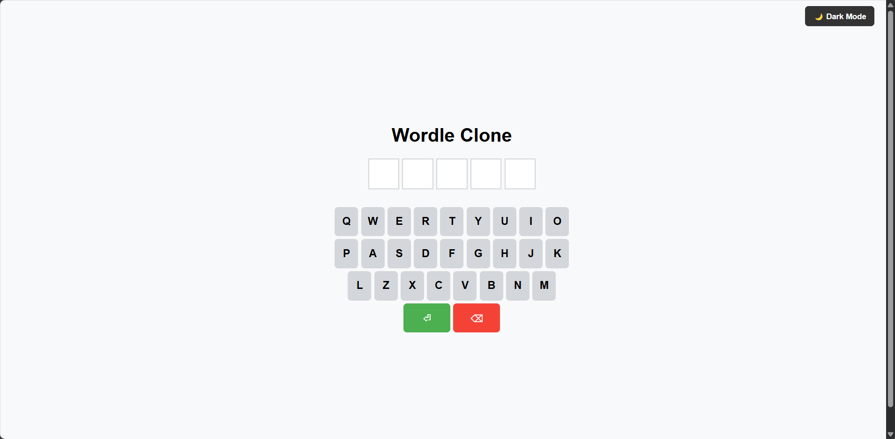

# Wordle Clone

- A simple Wordle clone built with React.js. This project allows users to guess a word within limited attempts, similar to the popular Wordle game.

## Features

- ✔ Word Guessing Game – Players guess a word within a fixed number of attempts.
- ✔ Color Indications – Correct letters in the right place turn green, correct letters in the wrong place turn yellow, and incorrect letters turn gray.
- ✔ Dark Mode Support – Users can toggle between light and dark mode.
- ✔ Responsive UI – Works seamlessly on desktop & mobile devices.
- ✔ Custom Word List – Add your own words in words.js.

## Folder Structure

    ```bash
    wordle-clone/
        │── src/
        │   ├── components/      # React components
        │   │   ├── Board.js     # Game board component
        │   │   ├── Row.js       # Row component for word tiles
        │   │   ├── Keyboard.js  # On-screen keyboard
        │   ├── utils/           
        │   │   ├── words.js     # List of possible words
        │   ├── App.js          # Main app component
        │   ├── index.js        # React entry point
        │   ├── styles.css      # Global styles
        │── public/
        │   ├── index.html      # Main HTML file
        │── package.json        # Project dependencies
        │── README.md           # Documentation

## Installation & Setup

1. Clone the repository
- First, clone the repository to your local machine:
    ```bash
    git clone https://github.com/yourusername/wordle-clone.git

2. Install dependencies
- Navigate to the project directory:
    ```bash
    cd wordle-clone

3. Then, install the project dependencies:
    ```bash
    npm install

4. Run the application locally
- Once the dependencies are installed, you can start the development server:
    ```bash
    npm start

- This will start the React development server at http://localhost:3000.


## How to Play?

- 1️⃣ Guess the hidden word within limited attempts.
- 2️⃣ Press Enter after typing your guess.
- 3️⃣ The tiles will change color:
    - 🟩 Green = Correct letter & correct position
    - 🟨 Yellow = Correct letter but wrong position
    - ⬜ Gray = Letter not in the word
- 4️⃣ Keep guessing until you win or run out of attempts!

## Preview of the UI



## Customization Guide

1. Change the Word List

- To modify the words, open src/utils/words.js and update the array:

    ```js
    export const WORDS = ["apple", "react", "smart", "learn", "water"];

2. 🎭 Enable Dark Mode by Default

- Modify App.js to apply dark mode on load:

    ```js
    useEffect(() => {
        document.body.classList.add('dark-mode');
    }, []);

## Tech Stack

- React.js – Frontend framework
- CSS3 – Styling
- JavaScript (ES6) – Logic implementation

## Deployment

- Live Demo: The application is hosted on Netlify.
- Access it here: https://dhruv-wordle-clone.netlify.app/